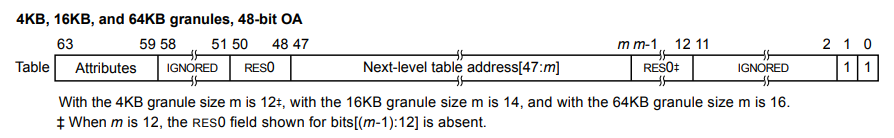
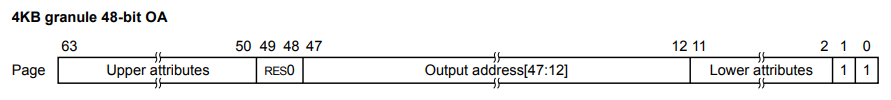

## CSIE 5374 Assignment 2 Write-up, Team16

### Add new system call to Linux

In `include/linux/syscalls.h`, we add the following structure to make it visible to the kernel when declaring and defining the new syscall.

This struct encapsulates all parameters that user‐space must pass when invoking `__NR_remap_page_table` syscall.

```c
struct expose_pgtbl_args {
    // PID of the target task
    pid_t pid;
    // User-space virtual address to map the page table page
    unsigned long remap_vaddr;
    // Physical frame number from the previous level page table entry
    unsigned long pfn;
    // page table level (0: PGD, 1: PUD, 2: PMD, 3: PTE)
    unsigned int level;
};
```
\
In `include/uapi/asm‑generic/unistd.h`, we define `__NR_remap_page_table` to be syscall number 451, hook it into the syscall dispatch table via `__SYSCALL(__NR_remap_page_table, sys_remap_page_table)`, and increment `__NR_syscalls` from 451 to 452 so the kernel knows there is one more entry in its syscall table.

```c
#define __NR_remap_page_table 451
__SYSCALL(__NR_remap_page_table, sys_remap_page_table)
    
#define __NR_syscalls 452
```
\
In `kernel/sys.c`, we define the new syscall entry point `sys_remap_page_table` and allocate a kernel‐side copy of the user arguments.

```c
SYSCALL_DEFINE1(remap_page_table, struct expose_pgtbl_args __user *, args)
{
    struct expose_pgtbl_args kargs;
    
    if (copy_from_user(&kargs, args, sizeof(kargs))) {
        pr_err("remap_page_table: failed to copy arguments from userspace\n");
        return -EINVAL;
    }
```
\
Here we locate the `target_task` using the specified PID and ensure the inputs are sane: the destination address must be *page‑aligned and the level must be between 0 and 3.

*page-aligned: we use `~PAGE_MASK` (which equals `PAGE_SIZE-1`) to extract the low bits of `remap_vaddr`. If any of these bits are set, the address has a non‑zero offset within a page, meaning it is not aligned to a page boundary.
```c
    struct task_struct *target_task = NULL;
    target_task = find_get_task_by_vpid(kargs.pid);

    if (!target_task) {
        pr_err("remap_page_table: pid not found\n");
        return -EINVAL;
    }

    if (kargs.remap_vaddr & ~PAGE_MASK) {
        pr_err("remap_page_table: remap_vaddr not aligned\n");
        ret = -EINVAL;
        goto out_put_task;
    }

    if (kargs.level > 3) {
        pr_err("remap_page_table: invalid level\n");
        ret = -EINVAL;
        goto out_put_task;
    }
```
\
The following section first retrieves the `target_task`’s memory descriptor and then determines which page frame to map: if `level` is 0, it computes the PFN of the task’s top‑level page directory; for levels 1–3, it validates and uses the PFN supplied by user space.

```c
    struct mm_struct *target_mm = NULL;
    pgd_t *pgd_va;
    unsigned long pgd_pa;
    unsigned long pfn_to_map;

    target_mm = get_task_mm(target_task);

    if (!target_mm) {
        pr_err("remap_page_table: target pid has no mm_struct\n");
        ret = -EINVAL;
        goto out_put_task;
    }

    if (kargs.level == 0) {
        pgd_va = target_mm->pgd;
        ...
        pgd_pa     = virt_to_phys((void *)pgd_va);
        pfn_to_map = pgd_pa >> PAGE_SHIFT;
    } else {
        if (!pfn_valid(kargs.pfn)) {
            pr_err("remap_page_table: invalid pfn\n");
            ret = -EINVAL;
            goto out_put_mm;
        }
        pfn_to_map = kargs.pfn;
    }
```
\
Next, we acquire a read lock on the caller’s address space, locate the VMA containing `remap_vaddr`, and then invoke `remap_pfn_range` to map the selected PFN into that page using the VMA’s protection settings.
```c
    struct vm_area_struct *remap_vma = NULL;

    if (mmap_read_lock_killable(current->mm)) {
        pr_err("remap_page_table: mmap_read_lock_killable failed\n");
        ret = -EINVAL;
        goto out_put_mm;
    }

    remap_vma = find_vma(current->mm, kargs.remap_vaddr);
    if (!remap_vma) {
        pr_err("remap_page_table: cannot find vma associated with remap_vaddr\n");
        ret = -EINVAL;
        goto release_mm_lock;
    }

    ret = remap_pfn_range(remap_vma,
                          kargs.remap_vaddr,
                          pfn_to_map,
                          PAGE_SIZE,
                          remap_vma->vm_page_prot);
    if (ret)
        pr_err("remap_page_table: remap_pfn_range failed\n");
```
\
Finally, we unwind locks and references in reverse order and return the result code to user‑space.
```c
release_mm_lock:
    mmap_read_unlock(current->mm);

out_put_mm:
    mmput(target_mm);

out_put_task:
    put_task_struct(target_task);

    return ret;
}
```

### Userfaultfd Program

The TODO section inside `static void *fault_handler(void *arg)` implements the core logic of the user-space page-fault handler:

1. **Anonymous page allocation**: we `mmap` a single page as a "template" without backing it yet.
2. **Trigger kernel allocation**: writing to `template_page[0]` causes a page fault, prompting the kernel to attach a real physical page to that mapping.
3. **Physical address lookup**: `va_to_pa` walks our page tables to find the new page’s physical address.
4. **Fault-page installation**: `map_fault_va_to_pa` uses the physical frame number to map the allocated page into the original faulting virtual address (`fault_addr`).

```c
char *template_page = mmap(NULL, PAGE_SIZE,
                           PROT_READ | PROT_WRITE,
                           MAP_PRIVATE | MAP_ANONYMOUS,
                           -1, 0);
template_page[0] = 0;  // trigger page fault
unsigned long pa = va_to_pa((unsigned long)template_page);
map_fault_va_to_pa(fault_addr, pa);
```
\
`va_to_pa` traverses every level of the target task’s page tables—from PGD down to PTE—to convert a given virtual address (`va`) into its corresponding physical address:
1. Use `remap_table(level, current_pfn)` to map that level’s page-table page (identified by `current_pfn`) into our address space.
2. `get_index(va, level)` pulls out the 9-bit index for this level from the virtual address.
3. Read `table_ptr[index]` and call `parse_table_entry()` to obtain the PFN of the next level (or the final data page).
4. `munmap` the temporary mapping and assert the PFN is non-zero.
5. After the last level, shift the final PFN by `PAGE_SHIFT` and OR in the original page-offset (`va & PAGE_MASK`) to form the full physical address.

```c
unsigned long va_to_pa(unsigned long va) {
    unsigned long current_pfn = 0;
    
    for (int level = 0; level < NUM_LEVELS; ++level) {
        uint64_t *table_ptr = remap_table(level, current_pfn);

        unsigned long index = get_index(va, level);
        uint64_t entry = table_ptr[index];
        current_pfn = parse_table_entry(entry);

        munmap(table_ptr, PAGE_SIZE);
        assert(current_pfn);
    }
    
    return (current_pfn << PAGE_SHIFT) | (va & PAGE_MASK);
}
```
\
`remap_table` builds a temporary user-space mapping for one page-table page at the specified `level`:
1. Allocates an anonymous page in the caller’s address space.
2. Fills an `expose_pgtbl_args` struct with the current PID, buffer address, target PFN, and level.
3. Calls syscall `__NR_remap_page_table` to install the page-table page into that buffer.
4. Returns a `uint64_t*` pointer so the caller can read the table entries directly.

```c
uint64_t *remap_table(unsigned int level, unsigned long pfn) {
    void *mapped_addr = mmap(NULL, PAGE_SIZE, PROT_READ | PROT_WRITE, MAP_SHARED | MAP_ANONYMOUS, -1, 0);
    assert(mapped_addr != MAP_FAILED);

    struct expose_pgtbl_args args = {
        .pid = getpid(),
        .remap_vaddr = (unsigned long)mapped_addr,
        .pfn = pfn,
        .level = level
    };

    assert(syscall(__NR_remap_page_table, &args) == 0);
    return (uint64_t *)mapped_addr;
}
```
\
`get_index` computes which entry to read in a given page-table level by:
1. Selecting the shift amount
    * `LEVEL_PGD`: `VA_PGD_SHIFT` (39)
    * `LEVEL_PUD`: `VA_PUD_SHIFT` (30)
    * `LEVEL_PMD`: `VA_PMD_SHIFT` (21)
    * `LEVEL_PTE`: `VA_PTE_SHIFT` (12)
2. Right-shifting the virtual address
    Moves the target 9 bits for that level down to the least-significant bits.
3. Masking off the low 9 bits
    Applying `& VA_INDEX_MASK` (i.e. `(1<<9)-1`) extracts exactly those 9 bits, yielding a value in `[0,511]`.

```c
unsigned long get_index(unsigned long va, unsigned int level) {
    int shift;
    switch (level) {
        case LEVEL_PGD: shift = VA_PGD_SHIFT; break;
        case LEVEL_PUD: shift = VA_PUD_SHIFT; break;
        case LEVEL_PMD: shift = VA_PMD_SHIFT; break;
        case LEVEL_PTE: shift = VA_PTE_SHIFT; break;
        default: assert(false);
    }
    return (va >> shift) & VA_INDEX_MASK;
}
```
\
According to the pictures, in the 4 KB granule, 48-bit output-address format, both a table descriptor (levels 0–2) and a page descriptor (level 3) encode their target address in bits `[47:12]`.

`parse_table_entry` extracts the next-level PFN from a raw page-table entry:
1. Verifies the entry is valid (e.g. "present" (bit `0`) and pointing to the expected table or page(bit `1`)).
2. `NEXT_LVL_ADDR_MASK` has bits ``[47:12]`` set (e.g. `0x0000FFFFFFFFF000`).
3. `NEXT_LVL_ADDR_SHIFT` is 12, to convert the masked address into a page-frame number (PFN).

This ensures we capture exactly the 36 address bits common to both table and page descriptors, then shift away the page offset to get the PFN.




```c
unsigned long parse_table_entry(uint64_t entry) {
    if ((entry & TABLE_ENTRY_MASK) == TABLE_ENTRY_VALUE) {
        unsigned long next_lvl_addr = entry & NEXT_LVL_ADDR_MASK;
        unsigned long next_pfn = next_lvl_addr >> NEXT_LVL_ADDR_SHIFT;
        return next_pfn;
    } else {
        return 0;
    }
}
```
\
`map_fault_va_to_pa` injects the newly allocated physical page (`pa`) into the original faulting virtual page (`fault_va`):
1. Compute target PFN
We shift the physical address (`pa`) by `PAGE_SHIFT` to obtain its page-frame number. This is the PFN we will insert into the target process’s PTE.
2. Page-table hierarchy walk
Same as `va_to_pa`.
3. Installing the new PTE
    * When `parse_table_entry` returns zero, we know we have reached the PTE level and there's no existing mapping for `fault_va`.
    * We construct a new PTE by OR’ing `PTE_FLAG` (the remaining page-descriptor attribute bits) with our `target_pfn << NEXT_LVL_ADDR_SHIFT`.
    * We then call `add_tracker(tracker)` to save the old PTE value plus its location; this allows us to restore the original page table when cleaning up.
4. Cleanup
After handling each level, we unmap the temporary buffer (`munmap(table_ptr, PAGE_SIZE)`) before proceeding, ensuring we don’t leak those mappings.

```c
void map_fault_va_to_pa(unsigned long fault_va, unsigned long pa) {
    unsigned long target_pfn = pa >> PAGE_SHIFT;

    unsigned long current_pfn = 0;
    for (int level = 0; level < NUM_LEVELS; ++level) {
        unsigned long table_pfn = current_pfn;
        uint64_t *table_ptr = remap_table(level, current_pfn);

        unsigned long index = get_index(fault_va, level);
        uint64_t entry = table_ptr[index];
        current_pfn = parse_table_entry(entry);

        if (!current_pfn) {
            assert(level == 3);
            table_ptr[index] = PTE_FLAG | (target_pfn << NEXT_LVL_ADDR_SHIFT);
            struct pte_tracker_t tracker = {
                .table_pfn = table_pfn,
                .table_idx = index,
                .original_entry = entry
            };
            add_tracker(tracker);
        }

        munmap(table_ptr, PAGE_SIZE);
    }
}
```
\
The following functions are for **bonus part**:
* `struct pte_tracker_t` records where and what PTE we overwrote.
* `add_tracker()` appends a new record to a dynamic array as we install our page mappings.
* `unmap_user_pte()` iterates all trackers, remaps each page-table page, restores its original entry, and then clears the tracker list.
* At the end of the main() function, we'll call `unmap_user_pte()`.

```c
struct pte_tracker_t {
    unsigned long table_pfn;
    unsigned long table_idx;
    uint64_t original_entry;
};

struct pte_tracker_t *trackers = NULL;
size_t tracker_size = 0;

void add_tracker(struct pte_tracker_t tracker) {
    tracker_size++;
    trackers = realloc(trackers, tracker_size * sizeof(struct pte_tracker_t));
    trackers[tracker_size - 1] = tracker;
}

void unmap_user_pte() {
    for (int i = 0; i < tracker_size; i++) {
        struct pte_tracker_t tracker = trackers[i];
        uint64_t *table_ptr = remap_table(LEVEL_PTE, tracker.table_pfn);
        table_ptr[tracker.table_idx] = tracker.original_entry;
        munmap(table_ptr, PAGE_SIZE);
    }
    tracker_size = 0;
}
```

### How to compile and run our test programs
```c
1. git apply YOUR_6.1_KERNEL.patch
2. make ARCH=arm64 CROSS_COMPILE=aarch64-linux-gnu- -j$(nproc)
3. gcc userfaultfd.c -o userfaultfd
4. sudo ./userfaultfd
```

### Result
```c
Fault handler thread created
Page 0: First byte was 
Page 0: First byte now A
Page 1: First byte was 
Page 1: First byte now B
Page 2: First byte was 
Page 2: First byte now C
Page 3: First byte was 
Page 3: First byte now D
Page 4: First byte was 
Page 4: First byte now E
Page 5: First byte was 
Page 5: First byte now F
Page 6: First byte was 
Page 6: First byte now G
Page 7: First byte was 
Page 7: First byte now H
Page 8: First byte was 
Page 8: First byte now I
Page 9: First byte was 
Page 9: First byte now J
All pages accessed successfully
Cleaning up resources...
Program completed successfully
```

### Contributions
All group members contributed equally to this work.

### Acknowledgement
We acknowledge the support of Gemini 2.5 Pro in this work. The information it provided was beneficial for brainstorming and developing initial concepts, as well as for providing assistance with various coding tasks.


